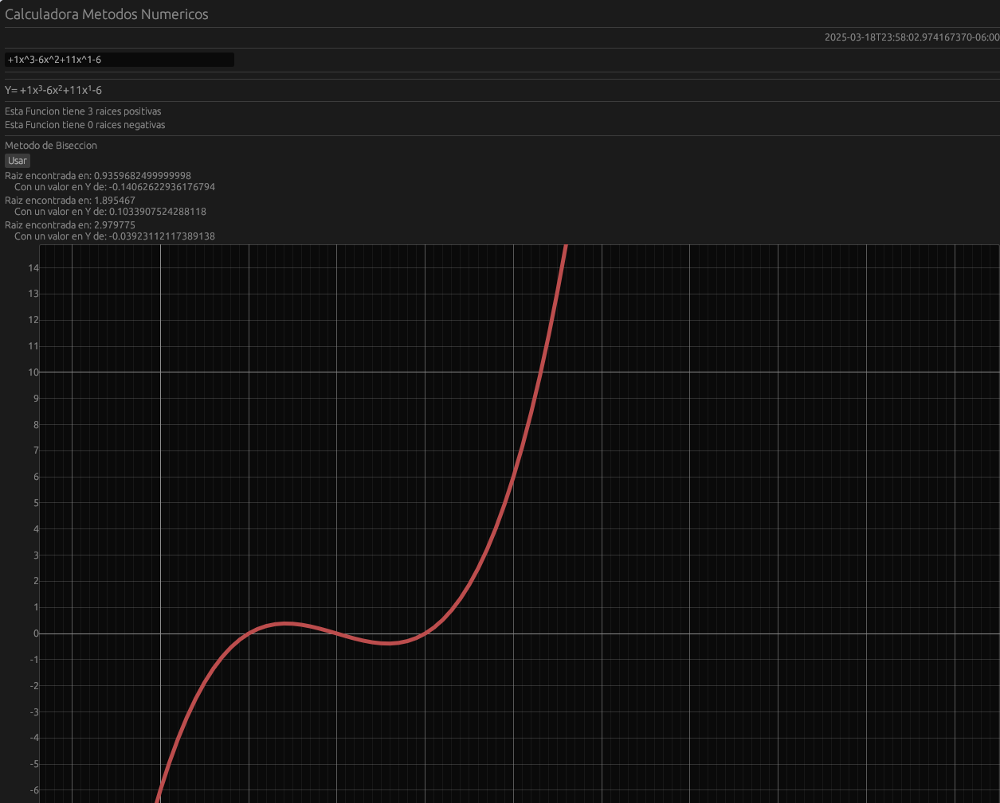
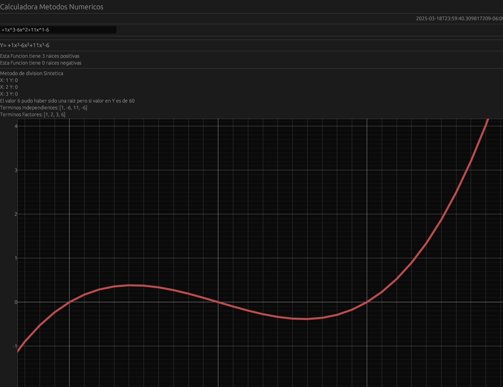

# Calculadora de Raíces

## Descripción
Este es un proyecto en Rust que implementa una calculadora de raíces utilizando diferentes métodos numéricos. La aplicación está construida con `egui` 

## Características
El proyecto permite calcular raíces de funciones mediante varios métodos, los cuales pueden activarse mediante features en Cargo:

- **Método de División** (`division`)
- **Método de Bisección** (`biseccion`)
- **Método de Newton-Raphson** (`newton`)
- **Método de Mises** (`misses`)
- **Interpolación de Lagrange** (`lagrance`)
- **Eliminación de Gauss** (`gauss`)
- **Controles de gráficos** (`plot_controls`)


Para habilitar un método específico, usa la opción `--features`:
```sh
cargo run --release --features "biseccion"
```
También puedes combinar varios métodos:
```sh
cargo run --release --features "biseccion newton"
```

### Ejemplos Gráficos
Método de Bisección:



Método de División:



